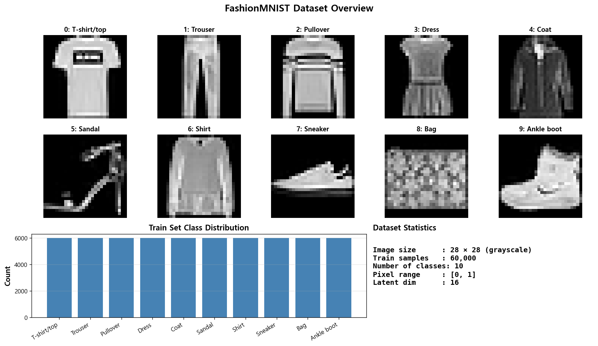
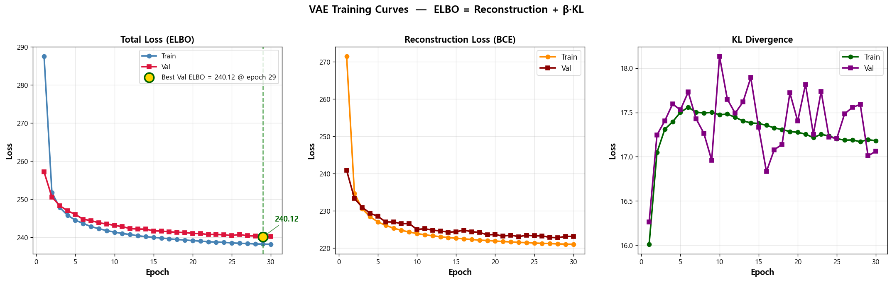
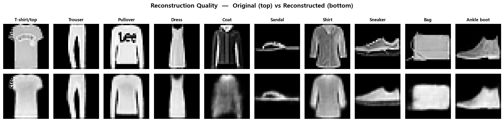
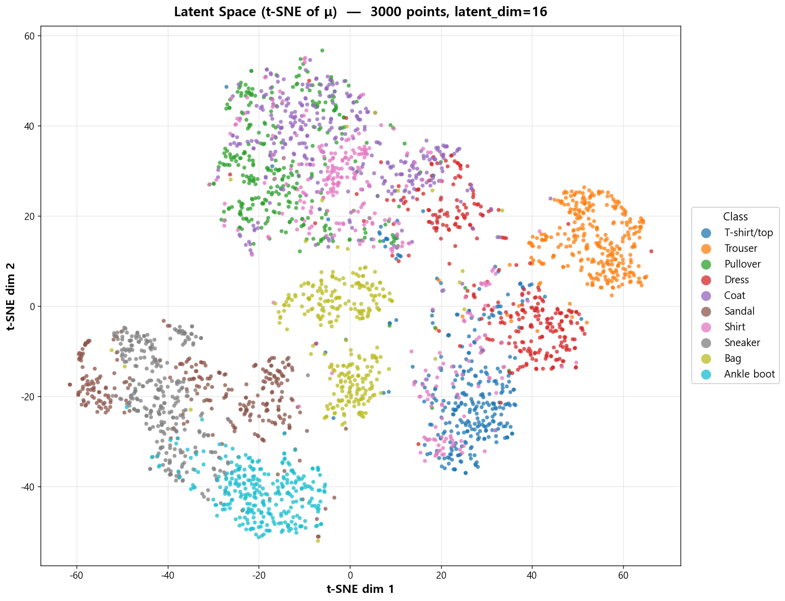
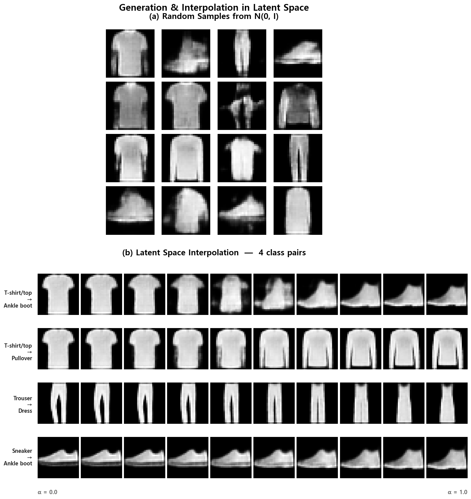
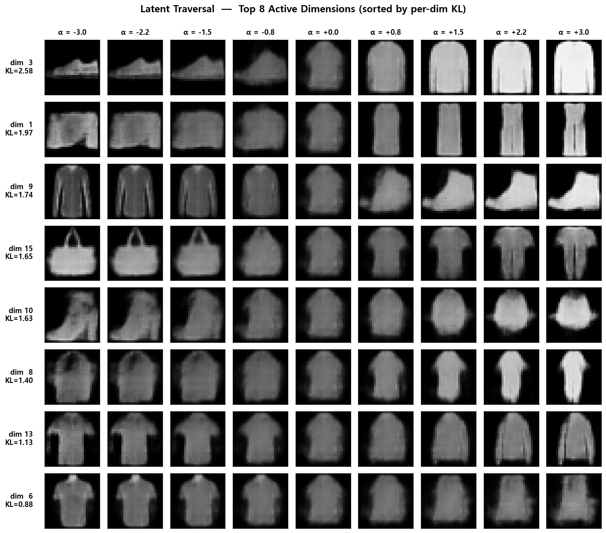

# 🎨 VAE from Scratch — A Variational Autoencoder for Image Generation in PyTorch
### FashionMNIST 28×28 이미지 생성을 학습하는, PyTorch로 직접 구현한 Variational Autoencoder


---

## 📌 프로젝트 요약 (Project Summary)

이미지 생성 모델의 가장 기초가 되는 **Variational Autoencoder (VAE)** 를 PyTorch로 구현해본 프로젝트입니다. 단순히 입력을 복원하는 일반 Autoencoder와 달리, VAE는 잠재 공간(latent space) 자체를 확률 분포로 학습해서 **새로운 이미지를 샘플링할 수 있는 생성 모델**이 됩니다. 그 핵심에 있는 **reparameterization trick**과 **ELBO 손실(Reconstruction + β·KL)** 을 구현해보면서 "왜 이렇게 짜야만 backpropagation이 흐르는가"를 코드 레벨에서 익히는 것이 1차 목표였습니다.

데이터셋은 **FashionMNIST**(28×28 grayscale, 60k/10k)이며, encoder/decoder는 모두 작은 CNN으로 구성했습니다. 학습이 끝난 뒤에는 학습 곡선(ELBO/Recon/KL 분리, Best Epoch 마커), 재구성 품질, t-SNE로 본 잠재 공간의 클러스터 구조, prior에서 샘플링한 새 이미지와 4쌍의 latent interpolation, 그리고 **각 잠재 차원이 어떤 의미를 capture하는지 보여주는 latent traversal**까지 6개의 시각화로 정리했습니다.

---

## 📂 프로젝트 구조 (Project Structure)

```
vae-from-scratch/
├── results/
│   ├── 01_dataset_overview.png            # FashionMNIST 10개 클래스 + 분포 + 통계
│   ├── 02_training_curve.png              # Total / Recon / KL 3-panel + Best Epoch 마커
│   ├── 03_reconstruction.png              # 10개 클래스 원본 vs 재구성 비교
│   ├── 04_latent_space.png                # t-SNE로 본 16차원 잠재 공간
│   ├── 05_generation_interpolation.png    # Prior 샘플링 + 4쌍 클래스 간 보간
│   └── 06_latent_traversal.png            # Top 8 활성 차원의 의미 분석 (per-dim KL 기반)
├── src/
│   └── main.py                            # VAE 모델 + 학습 루프 + 시각화 통합 스크립트
├── .gitignore
├── LICENSE
├── README.md
└── requirements.txt
```

---

## 🧩 핵심 개념 (Key Concepts)

| 개념 | 한 줄 설명 |
|------|-----------|
| **잠재 변수 모델 (Latent Variable Model)** | 입력 데이터를 저차원 잠재 변수 z로 압축해서 표현 |
| **인코더 (Encoder / Inference Network)** | 입력 x를 잠재 분포 q(z\|x)의 파라미터 μ, log σ²로 변환 |
| **재매개변수화 트릭 (Reparameterization Trick)** | z = μ + σ ⊙ ε — 샘플링 단계에 gradient가 흐르게 만드는 핵심 기법 |
| **디코더 (Decoder / Generative Network)** | 잠재 변수 z로부터 이미지 x를 복원 |
| **재구성 손실 (Reconstruction Loss)** | BCE — 입력과 복원 이미지 사이의 픽셀별 cross-entropy |
| **KL 발산 (KL Divergence)** | 학습된 잠재 분포가 표준정규 N(0, I)에서 얼마나 멀어졌는지 측정 |
| **ELBO (Evidence Lower Bound)** | Recon + β·KL — VAE가 최소화하는 전체 손실 함수 |
| **β 계수 (β-VAE Coefficient)** | β=1이 표준, 높이면 disentanglement 강조 / 낮추면 재구성 품질 강조 |
| **사후 붕괴 (Posterior Collapse)** | KL이 0에 가까워져 z가 무의미해지는 대표적 실패 모드 |

---

## 🏗️ 모델 구조 (Model Architecture)

```
입력: 28×28 grayscale image
   ↓
┌───────────────────────────────────────────────┐
│  Encoder (CNN)                                │
│   ├ Conv 1 → 32, stride 2  (28×28 → 14×14)    │
│   ├ Conv 32 → 64, stride 2 (14×14 → 7×7)      │
│   └ Flatten → FC → (μ, log σ²)                │
└───────────────────────────────────────────────┘
   ↓                ↓
   μ (16-dim)       log σ² (16-dim)
   ↓                ↓
┌───────────────────────────────────────────────┐
│  Reparameterization Trick                     │
│   σ = exp(0.5 · log σ²)                       │
│   ε ~ N(0, I)                                 │
│   z = μ + σ ⊙ ε   (16-dim)                   │
└───────────────────────────────────────────────┘
   ↓
┌───────────────────────────────────────────────┐
│  Decoder (Transposed CNN)                     │
│   ├ FC → reshape (7×7×64)                     │
│   ├ ConvT 64 → 32, stride 2 (7×7 → 14×14)     │
│   └ ConvT 32 → 1, stride 2 (14×14 → 28×28)    │
│       → Sigmoid                               │
└───────────────────────────────────────────────┘
   ↓
출력: 28×28 reconstructed image
```

| Component | 차원 / 설정 |
|-----------|------------|
| Input Shape | 1 × 28 × 28 (grayscale) |
| Encoder Hidden Channels | (32, 64) |
| Decoder Hidden Channels | (64, 32) |
| Latent Dim | 16 |
| Activation | ReLU (hidden) / Sigmoid (output) |
| Reconstruction Loss | Binary Cross-Entropy (sum, per-pixel) |
| KL Divergence | -0.5 · Σ(1 + log σ² - μ² - σ²) |
| β | 1.0 (표준 VAE) |
| **Total Parameters** | **205.8 K** |

---

## 📊 학습 결과 (Training Results)

학습은 RTX 4060에서 **30 epochs (약 4분 33초)** 로 진행했습니다. ELBO/Recon/KL을 모두 분리해서 기록했고, Train-Val 격차가 약 2 안쪽으로 매우 안정적인 학습 곡선이 나왔습니다.

| Epoch | Train Total | Val Total | Recon (Train) | KL (Train) | 비고 |
|-------|------------|-----------|---------------|------------|------|
| 1   | 287.53 | 257.15 | 271.52 | 16.01 | 학습 시작 |
| 5   | 244.51 | 246.02 | 227.01 | 17.50 | 빠른 초기 감소 단계 종료 |
| 10  | 241.35 | 243.13 | 223.87 | 17.47 | KL plateau 진입 |
| 20  | 239.13 | 241.03 | 221.86 | 17.28 | 미세 조정 단계 |
| **29**  | 238.22 | **240.12** | 221.03 | 17.19 | **Best Val ELBO** (early stopping 지점) |
| 30  | 238.16 | 240.19 | 220.98 | 17.18 | 최종 |

**핵심 관찰 (Key Observations)**

- **Train-Val 격차가 약 2 정도로 매우 작음** → overfitting이 거의 없는 깨끗한 일반화. 데이터셋이 크고(60k) 모델이 작아(205.8K) regularizer 역할을 하는 KL 항이 자연스럽게 작동한 결과
- **KL은 epoch 1에서 16.01 → epoch 6에서 17.56까지 잠깐 오른 뒤, plateau 후 미세하게 감소** → 학습 초반에 잠재 공간이 점진적으로 활성화되며 정보를 담기 시작했고, 후반엔 적절한 균형 지점에 안착. 우려했던 **posterior collapse는 발생하지 않음**
- **Best Val ELBO는 epoch 29에서 240.12** — 마지막 epoch과 거의 차이가 없을 정도로 학습 후반까지 일반화가 유지됨. Train ELBO도 마지막 epoch까지 단조감소하며 plateau 상태로 끝남

---

## 🔍 시각화 결과 분석 (Visualization Analysis)

### 1. Dataset Overview (데이터셋 개요)



FashionMNIST는 10개 의류 클래스 × 6,000장씩으로 **완벽하게 균등한 60,000장 학습셋**을 가진 데이터셋입니다. 각 이미지는 28×28 grayscale로 정규화 후 [0, 1] 범위의 픽셀 값을 갖습니다. 우측 통계 패널에 데이터셋의 핵심 사양을 한눈에 모았습니다.

특히 두 가지가 눈에 띕니다 — **첫째, 클래스 간 시각적 유사성이 적지 않다**는 점. 예를 들어 Pullover, Coat, Shirt는 윤곽선이 거의 같고, Sneaker와 Ankle boot도 모양이 비슷해서 단순 픽셀 수준에서 잘 분리되지 않습니다. 이게 latent space에서 의미 있는 클러스터를 만들기 위해 모델이 어떤 정보를 잡아내야 하는지를 자연스럽게 결정합니다. **둘째, 28×28이라는 해상도는** VAE의 blurry한 출력 특성을 적당히 가려주는 사이즈라 결과 해석이 깔끔합니다 (해상도가 더 높았다면 흐릿함이 훨씬 도드라졌을 것).

<br>

### 2. Training Curve — ELBO / Reconstruction / KL Divergence (학습 곡선 — ELBO / 재구성 / KL 발산)



VAE의 손실 함수를 **세 개의 패널로 분리해서** 그렸습니다. ELBO(전체) = Reconstruction(BCE) + β·KL Divergence 인데, 셋이 학습 중에 어떻게 다르게 움직이는지가 핵심입니다.

- **(좌) Total Loss (ELBO)** — Train은 287→238, Val은 257→240으로 부드럽게 감소. **금색 마커가 Best Val ELBO 지점(240.12 @ epoch 29)** 으로, 마지막 epoch(240.19)과 거의 동일해서 학습이 plateau에 안정적으로 도달했음을 보여줍니다
- **(중) Reconstruction Loss (BCE)** — 271→221로 약 50포인트 감소. 전체 손실 감소의 대부분을 차지 (예상한 대로 모델 capacity의 대부분이 픽셀 복원에 쓰임)
- **(우) KL Divergence** — 16.0에서 시작해 epoch 6에서 17.56까지 잠깐 오른 뒤 plateau. **이게 표준 VAE에서 가장 보고 싶었던 패턴**입니다. KL이 0으로 떨어지지 않는다는 건 잠재 공간이 정보를 적절히 담고 있다는 뜻 (= posterior collapse가 발생하지 않음). Val의 KL이 들쭉날쭉한 건 mini-batch noise이며, Train의 부드러운 곡선이 평균적인 거동을 보여줍니다

<br>

### 3. Reconstruction Quality (재구성 품질)



10개 클래스 각각에서 한 장씩 뽑아 **원본(위) vs 재구성(아래)** 을 비교한 그림입니다. VAE의 가장 유명한 특성인 **blurry reconstruction**을 직접 확인할 수 있습니다.

- 형태(silhouette)는 거의 모든 클래스에서 잘 보존됨 — Trouser의 두 다리 분리, Sandal의 구두굽 모양, Sneaker의 측면 윤곽 등
- **세부 디테일은 평균화돼서 사라짐** — T-shirt 가슴팍의 로고, Pullover의 패턴, Coat 후드 디테일 같은 high-frequency 정보가 흐릿해짐. 이는 BCE 손실이 픽셀별 평균을 최소화하는 방향으로 작동하기 때문에 자연스럽게 나타나는 현상이고, GAN이 더 선명한 결과를 내는 근본적 이유와 정확히 반대입니다
- 흥미로운 건 **Coat처럼 어두운 픽셀이 많은 샘플은 재구성이 더 흐려진다**는 점 — VAE가 비슷한 outerwear들 사이에서 평균적인 형태로 수렴하면서 디테일을 더 잃는 것으로 보입니다

<br>

### 4. Latent Space — t-SNE Projection (잠재 공간 — t-SNE 투영)



학습된 16차원 잠재 공간에서 검증셋 3,000장의 μ를 뽑아 **t-SNE로 2D 투영**한 결과입니다. 클래스 라벨은 학습에 한 번도 사용된 적이 없는데도, 잠재 공간이 **의미적으로 자연스럽게 정렬**되어 있습니다.

- **신발류 3개 클래스(Sandal / Sneaker / Ankle boot)가 하단에 모여 큰 메타-클러스터 형성** — 픽셀 분포는 다르지만 "발에 신는 것"이라는 공통 구조를 모델이 잡아냄
- **상의류(T-shirt, Shirt, Pullover, Coat, Dress)가 상단~중앙에 응집** — 모양이 서로 비슷한 만큼 클러스터 경계가 흐릿하게 겹침. 특히 Pullover/Coat/Shirt는 사람도 헷갈리는 케이스
- **Trouser(주황)가 우측에 명확히 분리** — 세로로 긴 두 다리 형태가 모든 다른 클래스와 시각적으로 가장 다르기 때문
- **Bag(올리브)도 별도 클러스터 형성** — 단순한 사각형 윤곽이 다른 의류와 확실히 구분됨

→ 핵심은 **"상의 / 하의 / 신발 / 가방"이라는 4개 메타-카테고리가 라벨 정보 없이 자연스럽게 만들어졌다**는 점입니다. VAE가 "비슷한 입력은 비슷한 z로" 압축하는 과정에서 시각적 의미 구조가 부산물로 나온 셈입니다.

<br>

### 5. Generation & Latent Interpolation (생성 및 잠재 공간 보간)



VAE가 단순한 Autoencoder가 아닌 **생성 모델**이라는 사실을 두 가지 방식으로 보여주는 그림입니다.

- **(a) Random Samples from N(0, I)** — 학습된 적 없는 z를 prior에서 16개 샘플링해서 디코더에 통과시킨 결과. 셔츠/바지/신발/가방/드레스 등 **FashionMNIST의 다양한 카테고리가 알아볼 수 있는 형태로 등장**합니다. 입력 이미지가 한 장도 없었는데 모델이 "FashionMNIST스러운" 새 이미지를 만들어낸다는 게 핵심

- **(b) Latent Space Interpolation — 4 class pairs** — 한 쌍이 아니라 **의미적으로 다른 4가지 변환 양상**을 한 번에 보여줍니다.
  - **T-shirt → Ankle boot**: 가장 극단적인 카테고리 점프. 5~6번째에서 셔츠가 무너지며 신발 곡선이 등장
  - **T-shirt → Pullover**: **같은 카테고리(상의) 내부 변환** — 소매가 점진적으로 길어지고 색이 어두워짐. 가장 부드러운 변화
  - **Trouser → Dress**: **두 다리 사이가 서서히 채워지며** 원피스 형태로 변환. manifold가 의미적 구조를 잘 학습했다는 가장 직관적인 증거
  - **Sneaker → Ankle boot**: 신발 굽이 점진적으로 높아지며 부츠로 변환

→ 만약 잠재 공간이 학습이 안 됐다면 (a)는 노이즈만 나오고, (b)는 두 이미지를 그대로 fade-in/out하는 cross-fade 형태가 됐을 겁니다. 같은 카테고리 내(T-shirt → Pullover)와 다른 카테고리 간(Trouser → Dress) 변환이 모두 자연스럽게 이어진다는 게 manifold가 **단순 라벨이 아닌 시각적 의미 구조**로 학습됐다는 직접 증거입니다.

<br>

### 6. Latent Traversal — What Each Dimension Captures (차원별 의미 분석)



t-SNE로 본 잠재 공간이 클래스별 클러스터를 만든다는 건 알았지만, **개별 차원이 무엇을 capture하는지**는 별도의 분석이 필요합니다. 이를 위해 **각 차원의 평균 KL contribution**을 계산해서 가장 활성화된 상위 8개 차원을 골라, base z를 0 vector로 두고 한 번에 한 차원만 [-3, +3] 범위로 변화시키며 디코딩한 결과입니다.

핵심 관찰:

- **dim 3 (KL=2.58, 가장 활성)** — α가 음수면 신발/부츠(어두운 옆모습), 양수면 긴소매 상의(밝은 직립). 가장 강력한 **"카테고리 축"**
- **dim 15 (KL=1.65)** — α=-3에서 **가방 손잡이까지 정확하게 그려짐**. 사실상 "가방 vs 의류" 카테고리를 단독으로 capture
- **dim 1 (KL=1.97)** — 짧은 옷에서 긴 바지/원피스로 변화하는 "**세로 길이/하의 정도**" 축
- **dim 9 (KL=1.74)** — dim 3과 의미는 같지만 부호가 반대인 "상의 ↔ 신발" 축 (α=-3에서 긴소매 상의, α=+3에서 부츠). VAE가 같은 의미적 변화를 여러 차원에 분산해서 표현하는 모습
- **dim 13 (KL=1.13), dim 6 (KL=0.88)** — KL이 작아질수록 변화 폭이 미세해지고 시각적으로 큰 변화가 안 보임 → **KL contribution이 그 차원이 담은 정보량의 정확한 척도**라는 시각적 증거

추가로 흥미로운 점은 **16개 차원 중 상위 8개의 KL 합이 전체 KL의 대부분을 차지**한다는 것입니다 (`top 8: 2.58+1.97+1.74+1.65+1.63+1.40+1.13+0.88 ≈ 13.0` / 전체 `KL ≈ 17.2`, 약 75%). 즉 **나머지 8개 차원은 거의 N(0, I)에 가까운 비활성 상태**로, VAE가 알아서 "필요한 만큼만" 차원을 사용하고 나머지는 prior에 묶어버린 셈입니다. β-VAE 논문이 강조하는 **자동 차원 축소(automatic dimension pruning)** 효과가 표준 VAE에서도 그대로 관찰됩니다.

---

## 💡 회고록 (Retrospective)

이 프로젝트를 시작할 때 가장 막막했던 건 reparameterization trick이었습니다. 책이나 블로그에서 `z = μ + σ ⊙ ε` 한 줄을 보면서 "그래 이렇게 쓰는구나" 하고 넘어갔던 식이었는데, 막상 직접 짜려고 보니 "왜 이렇게 안 짜면 안 되는지"가 잘 안 잡혔습니다. encoder가 (μ, σ)를 뱉고 거기서 정규분포 샘플을 뽑아서 decoder에 넣고 싶은데, 그냥 `z = torch.normal(μ, σ)` 식으로 짜면 샘플링 단계에서 gradient가 끊깁니다. ε을 분리해서 외부에서 뽑고 σ을 곱하는 트릭 한 줄로 backprop이 흘러가게 하는 발상 자체가 좀 영리하다 싶었고, 이걸 직접 짜고 나서야 "아 이래서 reparameterize 라고 부르는구나"가 좀 잡혔습니다.

또 하나 헷갈렸던 게, 손실 함수의 두 항이 의미상 정반대 방향으로 당긴다는 점이었습니다. Reconstruction 항은 "z에 입력 정보를 최대한 많이 담아라"라고 시키는데, KL 항은 "z 분포를 표준정규에 가깝게 만들어라"라고 시킵니다. β=1로 그냥 더했을 때 모델이 어떤 균형점을 찾는지가 처음엔 잘 상상이 안 갔는데, 학습을 돌려보니 KL이 16에서 시작해서 17.56까지 살짝 올랐다가 거기서 plateau 됐습니다. 처음엔 "왜 KL이 오르지?" 싶었는데, 생각해보니 **학습 초반엔 잠재 공간이 거의 활성화되지 않아서(= encoder가 정보 없는 z를 뱉어서) KL이 자연스럽게 낮고**, 학습이 진행되면서 z에 정보를 담기 시작하면 KL이 약간 올라가는 게 당연한 거였습니다. 이게 posterior collapse가 안 일어났다는 가장 확실한 신호이기도 했습니다.

재구성 품질이 흐릿하게 나오는 건 사전에 알고 있었지만 직접 보니 인상이 또 달랐습니다. T-shirt 가슴팍의 로고가 사라지고, Pullover의 패턴이 균질하게 뭉개지고, 특히 Coat처럼 어두운 픽셀이 많은 옷은 더 흐려지는 게 일관되게 보였습니다. BCE가 픽셀별 평균을 최소화하는 방향이라 어쩔 수 없는 결과인데, 전부터 "GAN은 선명한데 VAE는 왜 흐린가"가 궁금했었는데 이번에 좀 감이 잡혔습니다. VAE는 분포 자체를 학습하니까 평균에서 나오는 흐릿함을 안고 가는 거고, GAN은 discriminator가 픽셀 디테일을 평가하니까 선명도가 살아남는 거였습니다.

가장 재밌었던 건 t-SNE 시각화였습니다. **클래스 라벨을 학습에 한 번도 안 줬는데** 잠재 공간에서 신발 3종(Sandal, Sneaker, Ankle boot)이 한 덩어리로 모이고, 상의류가 또 한 덩어리, Trouser랑 Bag이 따로 빠져나가는 게 보였을 때 좀 놀랐습니다. VAE가 단순히 "입력을 잘 복원하라"는 목표만 줬는데, 그 부산물로 "비슷한 모양의 옷은 비슷한 z로 가야 한다"는 의미 구조가 자연스럽게 만들어진 셈입니다. 비지도 표현 학습이라는 게 이런 맥락에서 강력하다는 걸 처음으로 직접 확인했습니다.

Latent interpolation도 비슷한 맥락에서 인상적이었습니다. 처음엔 T-shirt에서 Ankle boot로 넘어가는 한 쌍만 그려봤는데, "이게 어쩌다 잘 나온 걸까, 다른 쌍은 어떨까"가 궁금해서 4쌍으로 늘려봤습니다. 결과를 보니 **같은 카테고리 안에서의 변환(T-shirt → Pullover)** 이 가장 부드러웠고 — 소매가 점진적으로 길어지면서 색이 어두워지는 게 자연스럽게 이어졌습니다 — 가장 흥미로웠던 건 **Trouser → Dress** 였습니다. 두 다리 사이가 점점 채워지면서 원피스 모양이 되는 게, 모델이 "다리"라는 픽셀 영역을 의미적으로 이해하고 있는 것처럼 보였습니다. 만약 클래스를 외우는 식이었다면 "Trouser 5장 → Dress 5장" 같은 갑작스러운 점프가 됐을 텐데, 실제로는 중간 단계가 어떤 옷도 아닌 형태로 부드럽게 이어졌습니다. 잠재 공간이 manifold라는 게 이런 의미구나, 라는 걸 그림 한 장으로 이해하게 된 순간이었습니다.

처음엔 여기서 끝낼 생각이었는데, t-SNE로 클러스터를 보고 나니 자연스럽게 또 다른 궁금증이 생겼습니다. **"그래서 16개 차원이 각각 뭘 담고 있는 건데?"** 라는 질문이었습니다. 그래서 base z를 0 vector로 두고 한 번에 한 차원만 -3에서 +3까지 변화시키며 디코딩하는 latent traversal을 추가로 그려봤습니다. 결과가 진짜 인상적이었는데, **각 차원의 평균 KL이 큰 순서대로 정렬해보니 위에서부터 명확한 의미가 잡혔습니다**. 가장 활성화된 dim 3은 "신발 ↔ 상의"라는 카테고리 축이었고, dim 15는 양 끝에서 가방 손잡이까지 그려질 정도로 "가방"이라는 카테고리를 거의 단독으로 담고 있었습니다. 더 인상 깊었던 건 활성도(KL)가 낮은 dim 6 같은 차원은 변화 폭이 거의 안 보일 정도로 미세하다는 점이었습니다. **KL이 그 차원이 실제로 담고 있는 정보량의 정확한 척도**라는 게 그림으로 직접 확인된 셈입니다. 그리고 16개 중 사실상 8개만 강하게 활성화되어 있고 나머지는 prior에 거의 묶여 있다는 것도 흥미로웠습니다 — VAE가 "필요한 만큼만 차원을 쓰고 나머지는 버린다"는 자동 차원 축소가 β=1 표준 설정에서도 자연스럽게 일어난다는 게 신기했습니다.

하이퍼파라미터는 거의 만지지 않았습니다. β=1, latent_dim=16, lr=1e-3, batch=128 — 거의 표준값으로 갔는데, 결과가 깨끗하게 나와서 더 만질 필요가 없었습니다. β를 4 정도로 올려서 disentanglement 실험을 할까 잠깐 고민했는데, 표준 VAE의 동작을 명확히 이해하는 것이 1차 목표였기 때문에 욕심을 줄였습니다. 다음에 β-VAE나 conditional VAE를 따로 다뤄볼 기회가 있을 것 같습니다.

학습 시간도 인상적이었습니다. RTX 4060에서 30 epochs가 4분 33초밖에 안 걸렸는데, GPT 프로젝트(약 30분)와 비교하면 한참 짧습니다. 모델이 작고(205.8K) 데이터가 정형화되어 있으니 당연한 결과지만, 생성 모델의 가장 단순한 형태가 이렇게 가벼운 자원으로도 의미 있는 결과를 낸다는 게 좋았습니다. GPU 없는 환경에서도 충분히 돌려볼 수 있는 규모라는 점도 마음에 들었습니다.

다음에는 같은 데이터셋에 GAN을 직접 짜서 VAE와 비교해보거나, latent space에 클래스 라벨을 conditioning해서 원하는 카테고리만 생성하는 conditional VAE를 해보고 싶습니다. 이번엔 "잠재 공간을 확률 분포로 학습한다"는 VAE의 가장 기본적인 아이디어를 손에 익히는 게 목표였으니, 다음엔 응용 쪽으로 한 번 가보려고 합니다.

---

## 🔗 참고 자료 (References)

### 핵심 논문

- Kingma & Welling, *Auto-Encoding Variational Bayes* (ICLR 2014) — [arXiv:1312.6114](https://arxiv.org/abs/1312.6114)
- Rezende et al., *Stochastic Backpropagation and Approximate Inference in Deep Generative Models* (ICML 2014) — [arXiv:1401.4082](https://arxiv.org/abs/1401.4082)
- Higgins et al., *β-VAE: Learning Basic Visual Concepts with a Constrained Variational Framework* (ICLR 2017) — [OpenReview](https://openreview.net/forum?id=Sy2fzU9gl)
- Doersch, *Tutorial on Variational Autoencoders* (2016) — [arXiv:1606.05908](https://arxiv.org/abs/1606.05908)

### 데이터셋 / 레퍼런스 구현

- Xiao et al., *Fashion-MNIST: a Novel Image Dataset for Benchmarking Machine Learning Algorithms* (2017) — [GitHub](https://github.com/zalandoresearch/fashion-mnist)
- PyTorch VAE Examples (공식 예제) — [GitHub](https://github.com/pytorch/examples/tree/main/vae)

### 블로그 / 해설

- Jaan Altosaar, *Tutorial — What is a Variational Autoencoder?* — [blog](https://jaan.io/what-is-variational-autoencoder-vae-tutorial/)
- Lilian Weng, *From Autoencoder to Beta-VAE* — [blog](https://lilianweng.github.io/posts/2018-08-12-vae/)
- Joseph Rocca, *Understanding Variational Autoencoders (VAEs)* — [Towards Data Science](https://towardsdatascience.com/understanding-variational-autoencoders-vaes-f70510919f73)
